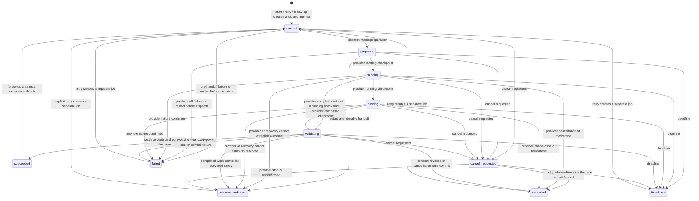

# Jobs pipeline

`JobService` has six execution entry points. Start, retry, and follow-up create new jobs. Cancel changes the current job. Dispatch and settle are private continuations that move the active attempt. The `prepare*` methods build the exact outgoing envelope and permission preview, but create no job and dispatch nothing.

The last five arrows are lineage, not mutation: retry and follow-up preserve the old terminal job and start a new `queued` job. `outcome_unknown` is terminal because the daemon will not guess that a provider did or did not run. A cancel request against it only records `cancelRequested`; the state stays `outcome_unknown`.

## The six entry points

1. **Start (`prepare` then `create`)** freezes source, selection, question, host instructions, provider plan, and outgoing bytes. `createAndAttempt` consumes the reviewed preparation and creates the job and attempt together. An idempotency key can return the same job, but cannot name different work.
2. **Retry (`prepareRetry` then `retry`)** accepts only `failed`, `cancelled`, `timed_out`, or `outcome_unknown`. It copies the frozen context into a new job, records `retryOfJobId`, and never reopens or silently replays the old job.
3. **Follow-up (`prepareFollowup` then `followup`)** requires a `succeeded` parent with a confirmed provider completion. It creates a new child job. A compatible live provider lease may resume; otherwise dispatch forks to a fresh provider turn.
4. **Cancel (`cancel`)** first writes `cancelRequested`. Before handoff it can prove nothing was sent and commits `cancelled`. After handoff it asks the adapter to stop, but a lost or unconfirmed stop becomes `outcome_unknown`, never a safe retry claim.
5. **Dispatch (`dispatch`)** writes the deadline, moves `queued` to `preparing`, revalidates consent and continuation compatibility, prepares the workspace/runtime, then installs the one-use send checkpoint. Provider checkpoints map `starting` to `sending`, `running` to `running`, and `completed` to `validating`.
6. **Settle (`settle`)** reads only a durable terminal provider checkpoint at the expected revision. It validates the final reply, revalidates consent at commit, pins any solver artifacts, and atomically commits `succeeded`. Provider failure, cancellation, unknown outcome, invalid output, or a lost fence commits the corresponding honest terminal state.

## Dispatch and commit fences

- `assertDispatchFence` compares the captured job with the current row immediately before and after consent finalization. It requires the same latest attempt, revision, state, deadline, packet and payload digests, execution policy, grant, provider/model/mode, frozen context, authorization, and continuation predecessor. It also requires a prepared workspace and forbids cancellation, an earlier handoff, or an earlier dispatch claim.
- `prepareSendCheckpoint` freezes the exact provider request and expected job. Its one-use `finalize` accepts only the matching `starting` handle with a provider instance identity. In one SQLite transaction it finalizes consent, marks durable handoff, checkpoints provider identity, and claims the provider-thread lease. A crash after that commit but before the external write remains `outcome_unknown`; the database cannot prove an external stream was not written.
- `recordSentContent` attaches the reviewed outgoing parts to that exact attempt only after both `handoffMarked` and `dispatchClaimed` are durable, and only once. It runs in the same outer transaction as checkpoint finalization. It records what the provider send was allowed to contain; it does not prove delivery.

## State inventory

The contract states are `queued`, `preparing`, `sending`, `running`, `validating`, `succeeded`, `failed`, `cancelled`, `timed_out`, `outcome_unknown`, and `cancel_requested`. The five terminal states are `succeeded`, `failed`, `cancelled`, `timed_out`, and `outcome_unknown`. Restart recovery may move unfinished work to `failed`, `outcome_unknown`, `timed_out`, or back through settle, but it never automatically redispatches a request whose handoff may have happened.
