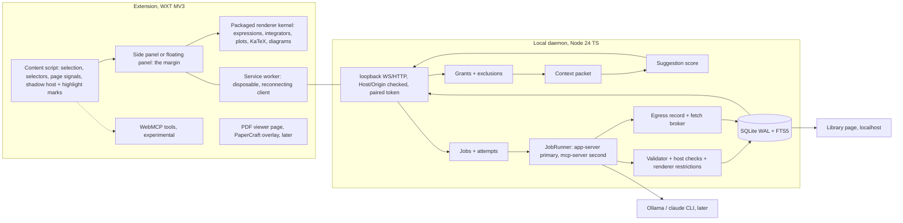

# Marginalia — Research Whitepaper

2026-09-17 · @Someone

Version 3, 17 September 2026, after three review rounds (Codex, GPT-6 Pro, and Astra's full package review) and the market comparison. Plain language in the body; engineering in the appendices. Change history: v1 research draft with a Bayesian need model (retired); v2 plain rewrite; v3 narrows the competitor and research claims, replaces generated reply code with typed blocks, corrects the demonstration model, separates the four privacy boundaries, and verifies the bibliography.

## Summary

Marginalia is a margin beside whatever you are reading. You select a passage, or write a note, and the margin gives you help in the form that fits: a definition in this context, a worked example with real numbers, a small model you can move, a diagram whose parts point back into the sentence, a check of what a claim rests on, a link to something you already read. The page itself is never rewritten. The work stays as a thread you can come back to next week. Your own Codex authors the help; your browser runs it.

It ships as a browser extension (the margin, in Chrome's side panel), a small local program that holds your notes and talks to Codex, and a page for your library. Your notes, highlights and threads are stored on your computer and export as plain files. Asking for help sends the passage to Codex's service, and the margin shows you exactly what goes before the first time it goes.

Three things make it different from a chat window beside an article. The help is anchored: every reply points at the exact words that prompted it, and you can check one against the other. The help changes form: a mechanism gets a picture, an equation gets numbers, a claim gets evidence. And the help accumulates: what you asked, wrote, kept and removed is your record, and it makes the next paper start from you rather than from zero.

What it deliberately is not: a summarizer, a chat transcript, a quiz app, or a system that decides what you already know and hides it from you.

## The problem, shown

Take one sentence from OpenAI's 8 September post on the Navier–Stokes problem: "The solution is a vortex, a spinning swirl of fluid, that spirals inward and gets increasingly elongated, like spaghetti."

Here is what a reader does today.

**Paste it into a chat.** You get four paragraphs on vortex stretching and the energy cascade. They are probably right. They are also in another window, they answer a question you did not quite ask, and the model's claims and the author's claims are now one block of text. Tomorrow you will not find them.

**Open a browser sidebar.** Most offer summarize, rewrite, or explain, and the explanation is another paragraph beside the page rather than attached to the sentence. Some keep a conversation history; none we checked lets you move a parameter in the answer or shows which part of it came from the page.

**Save it for later.** Read-later apps and annotators keep the page and your highlights, and the better ones (Readwise Reader, Hypothesis, Zotero) already give you anchored notes, library search with citations, and definitions on request. The vortex is still just words.

None of these is bad, and several already do parts of what follows: anchored annotation is established prior art, and persistent assistant conversations with library context exist. What is missing in every one we compared is the combination: a reply that changes form to fit the passage, that you can inspect and move without another request, whose parts each say whether they were quoted, computed, an analogy or fetched, kept beside the exact span at the source. That, not novelty of any single piece, is the claim.

The habit that this project grew out of: every time the author reads a paper in a new field, he builds himself an annotated copy that fills in the gaps. Marginalia is that annotated copy, made automatically, kept beside the original, and owned by the reader.

## What it does

The margin is a column that runs beside the page and scrolls with it. Three zones.

**Top: what this is.** One or two lines from the page's own metadata: what kind of page, when, who or where it was published. That much is local. On a site you have allowed, "assumes:" lists three to five terms the page uses without defining, and for a paper the venue comes from Semantic Scholar; both are lookups that leave your machine, so they wait for the site grant. If you have been here before, "you were here" takes you back. Once you start reading, this collapses to one line.

**Middle: your notes, and the replies to them.** Your notes and highlights sit in page order, always. The agent's replies are indented beneath the note or selection that prompted them, never above. A single "write here" line follows your reading position. The item at your position is full size; one section away is one line; further away is a tick; nothing fades. The position follows the page while you read and holds still while you are typing, moving a slider or have keyboard focus inside an item. So the column never grows longer than the page it mirrors, and nothing moves under your hands.

**Bottom: your library and the page actions.** Threads on this page, related things in your library, save, park, hear it. At the end of the page: "think with it" and "go further".

Collapsed, the margin is a thin rail: ticks for your marks, rules for sections, one dot while something is building.

### Asking

Select text. Selecting sends nothing. A small card appears at the anchor with Keep and Ask. If the page defines the term itself, that definition shows at once, quoted, marked "from this page". If you have allowed the site and turned on automatic definitions, a short definition arrives on its own and can be read and dismissed; that counts as a complete interaction. Otherwise Ask opens at most three suggestions. Deep help shows a time word ("\~1 min") and builds while you keep reading: working, a first frame marked provisional until its checks pass, ready, with cancel always visible. It asks one clarifying question at most. Everything else it assumed sits in a "what this example assumes (3)" line you can open and change.

A demonstration, on the vortex sentence:

1. You select "spirals inward and gets increasingly elongated". The card offers: see it (\~1 min), define, what supports this (\~30 s, needs the web).
2. You pick see it and keep reading. The card shows "working: a stretching spiral flow", then axes, then the moving picture — a prescribed incompressible velocity field that spirals inward and stretches along the axis, with the stretching rate as a slider.
3. Under the title, one sentence: "Illustration of the mechanism. Not the paper's fluid model or a reproduction of its result." You drag the slider; the vortex thins. Each variable name lights the phrase it stands for in the sentence.
4. A second illustration sits beneath: a one-line model of growth against damping, y′ = y² − γy + f. Its result sentence comes from the exact rule, not from what the plot happens to show: "Still rising at 8 s. This model diverges at 32.4 s."
5. You open what this example assumes (3): the stretching range, a constant forcing, no pressure or boundary. You change the range. The picture updates in place; nothing is sent.
6. Back to the sentence. The thread is saved. Next month, on the Euler paper, the margin says "you built a vortex illustration on the Navier–Stokes post" and offers it.

The same gesture on a term gives a definition in this passage's sense, at the level you told it to assume. On a claim, it gives what the author asserts, what supports it, with sources and dates, and what is contested. On a step in a procedure, it gives a runnable example. The reply changes form to fit the block. That is the whole idea.

### Replies

A reply is data, not code. Codex writes the model — the equations, the parameters and their ranges, the rule that decides the result sentence, the diagram's nodes and edges, the steps of a derivation, the claims and their sources — and the margin runs it with code that ships inside the extension. Running and thinking are different things, and a reply can be moved in four ways, cheapest first. Most interaction happens in the margin itself: sliders, hovers, revealing the next step, re-plotting, at no cost. Where a model needs more than the margin carries, Codex computes results once over a declared range, and the margin explores inside that range and says where it ends. Where you go outside it — a starting condition the range did not cover, a figure to reproduce — the solver Codex already wrote is run again on your machine with the new inputs, which takes time but asks the model nothing. Only a new question, or a change to the model itself, asks Codex again, and that is shown as an action, never hidden behind a slider. The rule that governs all four: every kind of help stays in scope; the margin's own engine is the default path, not the ceiling; anything it cannot do moves to an explicit alternative with the same anchor, assumptions, controls and thread, and nothing weaker is passed off as the same. Every reply is checked before it renders: does it match its schema, is it within bounds, does the cited span exist, do the host-run reference checks pass. A result sentence must be backed by one of those checks or it is not shown; a model with no exact criterion says "no conclusion beyond the shown interval" rather than "settles". A reply that fails is a plain sentence ("The calculation did not reproduce its starting value. Try again."), not a quiet card. A reply shows the thing itself; if it is an illustration, one visible sentence saying so; two small actions, "source passage" and "how this was made", with marks per part (quoted, computed, analogy, fetched); "what this example assumes (n)"; and the way back to the anchor. Kinds of ask: define, worked instance, see it, diagram, derive, what supports this, go further, and "not sure", which says what was missing.

### Notes

A note is yours: plain text attached to a passage or a section you chose, written in the margin as you read. The attachment is shown in words ("note on 'Viscosity pulls toward…' · change") and freezes when you start typing, so scrolling while you think does not move it. Notes sit above any reply at the same anchor. Press Ask on a note (a question mark offers it; it never sends on its own) and the margin treats the note as the question: "isn't this just Kelvin's theorem with a forcing term?" becomes the context for the suggestions, and the reply quotes the version of the note it answers. Notes also feed the vocabulary the margin uses to decide what needs defining; each entry says whether you used the word, looked it up, or told it to skip, and you can delete any of them.

### Memory

The margin remembers your work: threads, notes, highlights, the terms you looked up, what you removed, where you left off. It does not build a model of what you understand, and it never hides part of a page because of something it inferred. Section 8 explains why that line is drawn where it is.

## Ten rules

Each came from a specific failure we found while designing, and each is written so a reviewer can check the build against it.

1. **Never replace or disguise the source.** The original is always visible. Everything the agent makes lives in its own layer, anchored, attributed, removable. A summary you ask for is allowed; nothing is passed off as the text.
2. **Choose the form that serves the task.** A mechanism gets a picture, an equation gets numbers, a term gets a sentence. Text is fine. Adding text by default is not.
3. **The reader decides; the host checks.** No quizzes in normal use. Your marks close the loop. But you often asked because you could not verify, so each reply carries checks suited to its kind, and it may say "not sure".
4. **Context changes how, never whether.** What you tell it about yourself changes the level, the analogy, the order. Nothing you can ask for is ever removed because of it.
5. **Do not flatten every bump.** Learning happens where the text is a little too hard. The margin helps when you are stuck, stays quiet when you are not, and you set that dial.
6. **Control interruption, do not impose it.** One question before building, at most. An illustration proceeds with its assumptions marked. A claimed reproduction stops when data is missing.
7. **Every part of a reply says where it came from.** Page, your notes, fetched, or made up, per claim. A saved explanation is never later mistaken for evidence.
8. **Interact with the web, do not just consume it.** Threads, journeys and the journal are your record, exportable, on your machine.
9. **You bring the model.** Any provider, any key, local models, or your own agent, with honest degradation when a provider cannot do something.
10. **Thread states are observations, not verdicts.** Open, parked, done, archived, removed. A definition read in one glance is a success. A wrong reply is a failure even if you saved it.

## What the research says, and what it changed

Six findings from reading research shaped the design. Each is stated plainly, with what it made us do and what it stopped us doing, and with the limit of what it actually shows. The references were located at their publishers or archives in Astra's review; DOIs are in Appendix D. None of these studies tested a browser margin, so they motivate choices; they do not validate them.

**Readers slow down where words are unexpected.** Surprisal theory says the cost of reading a word rises with how unpredictable it is given what came before (Hale 2001; Levy 2008), and reading time tracks this close to linearly across a population (Smith and Levy 2013). So a small local model can nominate words on a page that readers in general find costly, before anyone selects anything. *What it changed:* the margin can underline candidate terms from surprisal, filtered by your vocabulary, as an option you turn on. *What it stopped:* we do not call this "the reader is confused". Population reading-time effects say nothing about one reader's understanding; names, numbers and familiar words used oddly all score high too; and a local model costs download, memory and time, which we measure rather than call free.

**Bigger models do not automatically track readers better.** For the model families and reading corpora they studied, Oh and Schuler (2023) found that surprisal from larger transformers fit human reading times worse, with later work from the same authors tying this to training data and capacity. *What it changed:* the difficulty estimate is a proxy that has to be validated against our own readers, not a setting we get right by picking the smallest model. Astra builds replies; it is never asked how confused you are.

**Understanding is building a picture, not decoding words.** Kintsch's model of comprehension (1988) and Zwaan's work on situation models (1995, 1998) say readers build a running model of what the text describes: who, where, when, what causes what, and that reading slows at breaks in that model. *What it changed:* this is the product's objective. Each reply tries to supply a missing piece of the picture: a timeline supplies time, a diagram supplies structure, a model you can move supplies cause and effect, a worked example supplies the concrete case. *What it stopped:* the theory motivates richer forms; it does not choose one. A diagram can distract or misstate a mechanism as easily as help, so which form to offer is a preference we learn from what readers take, and every form is checked before it renders.

**Learning needs the text to be a little too hard.** Bjork's "desirable difficulties" (1994) separate learning from immediate performance: some effort during study helps later retention. Studies of attention in infants (Kidd et al. 2012) and of learning progress in artificial agents (Oudeyer et al. 2007) show a similar preference for the moderately unpredictable, in their own settings. *What it changed:* the margin does not try to remove every difficulty. It offers help when you ask and leaves the rest alone, and you can lean the dial toward flow or toward learning. *What it stopped:* none of this fixes an optimal difficulty for an adult reading a web page, and effortless reading can still be useful (retrieval and practice do not need surprise), so the dial is yours and the default is quiet.

**Help tuned for beginners can be worse for experts.** McNamara and colleagues (1996) found that high-knowledge readers learned more from a less coherent biology text, because filling the gaps forced them to think; Kalyuga's review (2003) collects similar reversals in instructional design. Readers also overestimate what they understand (Rozenblit and Keil 2002). *What it changed:* personalization tunes how help is given and in what order, and for readers above the text's level the better first offer is a question or a critique. *What it stopped:* these studies support adapting help, not withholding it. Keeping every action available is a decision about autonomy, not a theorem. It is also why an earlier design, in which you tapped "got it" and the margin quietly stopped helping there, was removed: a casual tap would have made silence look like competence.

**Behaviour in a browser is a weak signal.** Eye-tracking research treats regressions, going back to re-read, as the clearest sign of a comprehension break (Rayner 1998), and finds long fixations ambiguous, since staring and mind-wandering look alike (Bixler and D'Mello 2016). A browser sees neither: scroll-back also means navigation, a citation check, a layout shift or a distraction, and dwell time is contaminated by hidden tabs and idle time. *What it changed:* re-selection and scroll-back are logged and may inform how much ambient help appears; they never decide what you need, and time on a paragraph is not used on its own.

The earlier draft of this paper wrapped these findings in a three-layer Bayesian model with a "need" posterior and a log-linear utility. The Codex review showed the central quantity could not rank anything, since it multiplied every option by the same factor. That model is gone. Section 7 describes what replaced it.

## What already exists

A documentation comparison of about forty products (September 2026), an independent review, and Astra's source check corrected an earlier, emptier picture twice. This is what the primary sources establish; "not documented" never became "cannot do it":

| Kind of tool | Examples | Good at | Not documented |
| --- | --- | --- | --- |
| Read-later and annotators | Readwise Reader, Hypothesis, Zotero, Matter, Glasp, Obsidian Web Clipper | capture, highlights, anchored notes and threads, exports; Readwise's Ghostreader keeps conversations, cites the library, runs custom skills; Zotero is a full PDF reader with notes; the Clipper interprets pages with any provider, local ones included | a reply that changes form and can be moved; per-part origin; checks on the reply |
| AI browsers and sidebars | ChatGPT's desktop browser, Perplexity Comet, Claude in Chrome | seeing the page, acting on it, ubiquity; some keep memory | anything anchored to the span at the source; provenance separation |
| Research assistants | Gemini Notebook (formerly NotebookLM), Anara, SciSpace, Elicit | citations to passages; synthesis across documents; Gemini Notebook produces mind maps, audio, video, quizzes | passage-level interaction at the source; inspectable models; a reader-owned local store |
| Open and local | Khoj, SurfSense, Memex | ownership, any model, retrieval over your own material | a margin on a live page; typed, checked replies |
| Vendor science tools | OpenAI Prism | writing-time help for LaTeX papers | it writes into the document; closed; no reader record |

**The academic lineage matters most.** ScholarPhi (Head et al., CHI 2021) put definitions of terms and symbols beside a paper and showed readers used them. It grew into the Semantic Reader project (Lo et al. 2023): ten prototypes, studies with over 300 participants, and a production reader. That project also made the pattern we build on: an untouched PDF underneath, positioned overlays on top. Their open library, PaperCraft, is about 1,800 lines of TypeScript and is exactly the overlay model. CiteSee (Chang et al. 2023) marked citations by their link to the reader's library, which is the kind of personalization we keep. Scim let readers set highlight density themselves. Threddy organized reading into threads.

That lineage continues: Qlarify (UIST 2024) expands abstracts on demand, Paper Plain rewrites for lay readers, and the Semantic Reader platform hosts newer model-driven prototypes. What it did not have, and what Marginalia adds, is narrower than "nobody has done this": a reply that is an inspectable, movable model rather than text, authored by an agent with execution and the open web, checked by the host before it renders, on any supported web page rather than a hosted PDF, with a record the reader owns. We credit the lineage and build on its overlay model.

**The closest comparator on the first article** is SciSpace Copilot: a Chrome extension that explains selected text, snips equations and tables in PDFs, and answers follow-ups in a chat panel. It is fast and it works. What its documentation does not show is a reply you can move, parts that say where they came from, or work kept at the source; and define is an onboarding convenience it already offers, not our headline. The difference has to be visible in the first reply, not in a roadmap.

Two unoccupied positions came out of the market study and both are ones we chose *not* to fill: an inferred model of what the reader knows, and a document that collapses what you know. The research above says the first is unverifiable from behaviour and the second harms experts. We take the third open position instead: an agent margin beside an untouched source, with a record the reader owns.

## How suggestions are chosen

When you select something, the margin shows two or three suggestions. Which ones, and in what order, is a small calculation, not a judgment about you.

Two decisions are kept apart. The first is whether to offer help you did not ask for, and how much: that is an ambient policy, off by default, driven by page-level difficulty signals. The second is which replies to suggest after you select: that is a per-reply score. A number that is the same for every option at a block cannot rank the options, so difficulty signals inform the first decision, not the second. That correction came from the Codex review and it is the reason the earlier equations were dropped.

The score itself is additive and plain:

```
eligible = replies this host, this provider and your permissions can run
score    = how well the reply fits the block (a term, an equation, a mechanism, a claim, a step)
         + how well it fits the page (a paper, docs, an article, a social post, a reference page)
         + what you said you prefer
         + whether a useful reply already exists nearby
         - a penalty for repeating something you just dismissed
show     = the top three, in fixed positions, plus More and a line to type your own
```

The only hard filter is eligibility, and it means capability and permission, never a guess about relevance. Cost is a word on the chip ("\~1 min"), not a divisor; a slow reply that fits is still first. Once suggestions are drawn they do not move under your pointer; if better ones arrive, a quiet "more ideas" line appears.

A note changes the score: "isn't this just Kelvin's theorem?" raises *connect* and *critique* and lowers *define*. Page type changes it: on a social post, *what supports this* leads; on a paper, *worked example* and *see it* lead.

Every time suggestions are shown, the margin records what was eligible, what was shown where, what you chose or did not (including choosing nothing), how long it took, and what happened after. When that log is big enough, a choice model with an outside option and position effects can be fitted so that per-reader and per-block effects reorder replies rather than scale them together; a feature added identically to every option cancels from such a model, which is the mistake the earlier draft made. A deterministic policy says little about options it never showed, so this needs deliberate exploration and reader-grouped evaluation, not a weekly refit on a dozen users. Predicting what you click is not the same as helping you, so usefulness, correctness and reading continuity are measured separately (section 9).

## Memory of work, not of mind

The product remembers what you did, in a form you can open, edit and export. It does not claim to remember what you know. This is the line the research pushed us to, and it is also the version of continuity that survives scrutiny: every stored item has a visible origin.

**Vocabulary.** A list of terms with their origin: used in your own notes, looked up, or stated familiar by you. Using a word in a note is evidence of use, not of mastery (a note can copy a term or ask what it means), so the three origins are kept apart and none is ever presented as "you know this". The fields you named at setup seed a weak prior. The list is a page in settings you can edit or delete from. It decides what gets underlined, nothing more; an empty result says "no definition found for this selection", never that nothing needs defining for you.

**Stated context.** "Assume undergraduate physics." "Explain through linear algebra." "Relate this to my note on renormalization." You supply context where it helps; the system does not reconstruct your state of knowledge from behaviour.

**Threads.** A selection or note, the replies beneath it, the assumptions, what is unresolved. Anchored to a version of the source, so it reattaches when the page is reopened and survives edits to the live page. States: open, parked, done, archived, removed.

**Journeys, topics, the journal.** Threads grouped around a question, proposed by the margin and accepted or renamed by you. Topics over journeys, editable. A journal written for you, not consulted by the system: "this week you opened four things on turbulence, built two simulations, left three threads open, and *enstrophy* came up in three documents." That is where memory of work starts to look like memory of yourself, on the page, in your own trail.

**The library.** Save any page or PDF with a snapshot. Highlights and notes as your own layer, in the W3C annotation format so they move to Hypothesis or back. A queue. Search across everything you saved, with answers that cite the passage they came from and say so when they cannot. "Related in your library" on every page you open, which is what makes the tenth paper different from the first. Export to Markdown and JSON; Obsidian and Zotero connections before any claim to replace them.

**Posture.** One control: lean toward flow, or toward learning. It changes which suggestion comes first (short definitions, or questions and critiques) and how much ambient help appears. Nothing is ever suppressed by it.

**What is inferred, and what is not.** Which replies you tend to take on which kind of block is inferred from your clicks. Your vocabulary trail is inferred from your writing. A model of what you understand is not. If a later experiment shows such a model helps, it enters as a page you can read and edit, never as a hidden weight.

**One rule about saved explanations.** A reply the agent wrote last month keeps its origin when it is retrieved. It can be shown to you again; it can never be cited as if it were evidence. If a reply is corrected, everything derived from it is marked.

## Privacy, copyright, and how we know it works

**Four boundaries, four promises.** "Local" is not one thing, so the margin makes four separate promises and asks four separate permissions. *Storage:* your notes, highlights, threads and the record stay on your computer and export as plain files; reading and note-taking work with no helper and no account. *Cloud inference:* Codex is a service; asking sends the passage, your note, page facts and a bounded slice of context to it. The first time text from a new site is about to go, the margin shows the exact text, the recipient and the scope and asks once: this time, always on this site, or never on this site. A denial persists. A dot in the rail lights while data is leaving, separately from the dot that means "working", and it opens the record of what went where. Nothing automatic (assumed terms, a venue lookup, an automatic definition) runs before that grant, because a title sent to Semantic Scholar is also something leaving your machine. *Tool network:* for define and see it, Codex's sandbox has its network switched off, and a test proves it. *The web:* what supports this and go further need it, which is a second, narrower permission per site; every page fetched goes through the daemon's broker and is recorded, and if a session could reach around the broker the record says "incomplete" rather than pretending. Provider credentials never enter the browser; the extension holds one revocable token for talking to its own local helper, and nothing else.

**Copyright.** This is our reading as of September 2026, not legal advice; counsel decides before anything is hosted or shared at scale. Keeping a private copy of a page for your own reading is what read-later apps have done for fifteen years, and in Germany the private-copy provision (§53 UrhG) is the usual frame, with its own conditions. Sending text to a model for analysis may fall under the text-and-data-mining exceptions (DSM Directive Article 4; §44b UrhG), which require lawful access, honour machine-readable reservations, and expect copies to be deleted when no longer needed; Article 3 is for research organizations and is a different provision. Whether a particular workflow, especially a hosted one, sits inside an exception is a case-by-case question. Leaving the source untouched is a design principle and an argument we can make to publishers; it does not by itself settle whether a shared reply, excerpt or snapshot is an adaptation. So sharing a thread ships your notes and the replies with source excerpts excluded by default and previewed, and re-anchors to a source the recipient fetches themselves.

**Why the vendor precedent does not settle it.** Browser assistants read every page under their own consumer terms, as the first party. Marginalia would be a third party sending other people's pages, and potentially your bank's, to a provider under API-style terms. Hence: no automatic processing outside long-form pages, your own exclusion list, local storage, and a settings pane that states each provider's retention terms rather than assuming them.

**How we know it works.** The decisive test is whether readers come back on their own documents, and whether the record makes the next document easier. Five things are measured separately and never merged: whether replies are correct (audited against the source), whether they are useful (readers return to reading faster and reopen threads), whether suggestions predict choices, whether reading continuity is preserved, and, only in a separate study, whether anything is learned.

| Question | How we test it | What counts |
| --- | --- | --- |
| Does a reply in the margin beat pasting the passage into a capable assistant? | same passage, both ways, within the same reader; time to get back to reading; one comprehension question | faster return, no worse understanding |
| Do the suggestions get better? | held-out fit of the choice model on the click log, weekly | rising fit; stable population weights |
| Is the difficulty map right? | correlation of the local estimate with scroll-back and help requests | positive and improving as vocabulary grows |
| Does help harm experts? | split by self-declared level; explanation-first vs question-first | no expertise-reversal pattern, or posture handles it |
| Detour or platform? | share of excursions ending in keep, park, or return, versus abandonment | abandonment falls over weeks |
| Second-document value | pairs of related documents, with and without the library match | readers use the match; less re-reading |
| Will people pay? | a bounded paid continuation offered at a fixed checkpoint in the alpha | conversion measured, not assumed |

The alpha cohort is twelve to fifteen people who already use an assistant while reading technical material and can catch some of its errors: graduate students, engineers, cross-disciplinary researchers. That many people can find workflow failures and repeated value; they cannot prove learning or stable subgroup effects, and we do not claim they will. Protocol: record installation completion (invited, installed, activated, returned, as counts); one passage task and one return task with different but comparable passages, order counterbalanced, against each participant's real assistant including its image and code tools; a second document brought the following week; an interview on why a thread was reopened or abandoned; an audit of a sample of replies against source claims, with refusals counted separately from confident errors. Research consent is asked before any content or behaviour is collected; local logging does not authorize upload. A learning-outcome study, with delayed retention and controls, is a separate piece of work.

## The launch and what comes after

**Surfaces.** One reading engine, one record, three surfaces that share a data model but not their storage or security contexts:

| Surface | What it is | When |
| --- | --- | --- |
| Extension | the margin, in Chrome's side panel; an identical floating panel where the side panel does not exist (the ChatGPT desktop browser, Firefox); the packaged renderer that runs replies; an experimental WebMCP adapter where the browser supports it | now |
| Local program (the daemon) | holds the store, runs jobs, talks to your Codex, checks replies, keeps the record of what left the machine and brokers web fetches; serves the library page on localhost | now |
| Library page | save, queue, highlights, threads, journeys, journal, search, export, settings, grants | localhost now; hosted later, with its own privacy contract |
| PDF viewer | the extension's own page for papers, on the Semantic Reader overlay model | after launch |

**The launch (GPT-6 Astra Challenge, Product Hunt, 18 September 2026, 00:01 Pacific).** The entry is the real product: the extension and daemon, on the OpenAI Navier–Stokes post and one page the demo team has not seen. The sixty seconds: select the vortex sentence, watch the illustration build while scrolling on, move the slider, read the result sentence that agrees with the mathematics, open what it assumes, come back to the sentence, reload and find it all still there. Define and see it are in the recorded run; what supports this and go further join it only if their gate (a closed session provably offline, an open session with a complete fetch record) passes on the day, and otherwise appear as an honest "needs web access, coming" state. Distribution at launch is an alpha path, an unpacked extension plus a daemon installer, and the listing says so; a fresh-machine install is part of the recorded run. Copy follows the entry packet's eight gates: fresh session, an unseen passage, honest limits, cancel and failure exercised, no credential exposed, video and listing that match the build. Astra and Luna are named where they are used. No "first", "only", "any page" or "offline". No upvote asks.

**After launch, in order.**

1. *Alpha.* Bring-your-own pages and PDFs; the vocabulary and the exposure log from the first day; twelve to fifteen readers compared against their real workflow; a bounded paid continuation at a fixed checkpoint.
2. *Home.* The library page as the product's home: queue, journeys, journal, search with cited answers, export; Obsidian and Zotero; the PDF viewer; voice and image replies.
3. *Providers and skills.* Local models and the official Claude CLI behind the same router; a hosted library with its API adapter; user-installed skills with their own permission gate; a fitted ranking once the log supports it; the shared store with Noether IRE, so reading and writing become one loop.

**Business.** Open-source extension and daemon. A hosted convenience tier for readers who would rather pay than configure inference. Sync and institutional deployment later. You bring the model is an architecture fact, not a pricing model; "never tokens" was an earlier constraint and it is dropped.

## Open questions and risks

- A confident, good-looking reply can be wrong. Our own first demo model did exactly this: it reported "settles" for parameters that diverge after the plotted window. The rule that came out of it, that a result sentence must be backed by a host-run check, reduces this; it does not remove it. The alpha's error audit is the real test.
- "What supports this" is the hardest reply to get right, because abstaining when nothing can be cited is harder than plotting a curve. It ships only when its gate passes.
- Replies are data rendered by packaged code. That keeps the store policy and the security boundary honest, and it limits what a reply can be to the block types the renderer knows. Growing that set (grids, richer diagrams, 1-D fields) is steady work, not a switch.
- Chrome's built-in PDF viewer blocks extensions, so papers need our own viewer page. Until it ships, PDFs go through the web reader.
- Assumed terms and venue lookups cost money and send text. They wait for the site grant, are cached by content hash, and show in a per-day spend line.
- Term novelty against an empty vocabulary overestimates difficulty for new users. The field prior from setup softens it; your own notes fix it over time.
- Subscription-funded inference through Codex is tolerated by OpenAI in public statements, not guaranteed in its terms. If it narrows, keys and local models remain.
- Requiring a Codex account, a local helper, an extension, permissions and pairing narrows the launch audience to technical readers. "Friendly to a first-time web reader" is an ambition for the margin's design, not a claim about the install; the funnel is measured before low use is read as a verdict on the idea.
- Sharing a thread that includes saved source text is redistribution. Until counsel says otherwise, a share carries the margin and a reference to the source, not the source.

## Appendix A. Architecture

Three parts, one store, one reply contract. The daemon owns the record and the agents; the extension is the margin and runs the replies; the library page is the home. Words used in code (reply\_version, job, attempt, grant, egress event) never appear on screen.



**Daemon.** Node 24 LTS and TypeScript (Node 20 reached end of life in March 2026); Tauri packaging later (Noether IRE's shell, provider descriptors and egress classes port over). Owns: SQLite with WAL and FTS5 (vectors only when a measured retrieval problem needs them); jobs and attempts with an outbox so a reconnecting client can replay; the provider router; a `JobRunner` interface {start, resume, cancel, inspect} with two Codex adapters, `codex app-server` over stdio (thread/start, thread/resume, turn/interrupt, live events; primary) and `codex mcp-server` (second; cancel degrades to abandon and tombstone), the Codex version pinned and checked at pairing; reply validation; the egress record and the fetch broker; an outward MCP server later so the reader's ChatGPT or Claude Desktop can query the library. Serves the library page on localhost. Binds to loopback only, validates Host and Origin, and pairs the extension by a short-lived six-digit challenge exchanged for a random 256-bit token that can be revoked.

**Extension.** WXT, Manifest V3. The content script captures the selection with W3C selectors (exact quote with prefix and suffix, text position; TeX from `annotation` or `alt` when present), page metadata, and instant-tier signals; it draws marks with the CSS Custom Highlight API from a namespaced shadow host and never edits the page's own nodes; it can register the WebMCP tool surface where the browser supports it. The margin renders in Chrome's side panel where the API exists (opened on a user gesture) and in an injected floating panel elsewhere, identical content. Replies are typed blocks rendered by the packaged kernel: a bounded expression grammar, RK4 and adaptive RK45 with step and horizon caps, iterated maps, closed-form evaluation, KaTeX, a diagram layout engine, plots, tables, citations and shelves. No generated markup or script is ever executed; that is the Chrome Web Store's rule for MV3 (code in the package, only data at runtime) and also the security boundary. The service worker holds the daemon connection and assumes it can be killed at any time: authoritative state lives in the daemon. Dynamic pages are allowed to change; anchors reattach with a visible state (exact, moved, unsure, lost) and never guess through ambiguity. Without the daemon, reading, notes and cached threads still work and the margin says so.

**Library page.** The same reading engine plus the store: queue, highlights, threads, journeys, journal, search with cited answers, export, settings (models per tier, excluded sites, vocabulary, spend). Localhost first. A hosted version needs the API adapter and a server-side store and is a separate build with its own privacy contract.

**A reply, end to end.**

1. **Selection or note.** The content script sends the span, selectors, section context, page metadata and any stated context. Selecting alone sends nothing to a provider; Keep and Park never do.
2. **Grant.** The daemon checks exclusions (site, credential fields, browser pages) before extraction and again here, then the site grant. On the first send for a site the margin shows the exact payload, the recipient and the scope, and records the answer.
3. **Packet.** A bounded packet: the excerpt (truncation deterministic and flagged, never silent), up to one section of context, page facts and source version hash, stated context, vocabulary and library hits only within the grant, the reply's instructions and schema, and a list of what was left out. Hashed and written to the egress record with its recipient before anything leaves.
4. **Suggestion.** The score picks two or three eligible replies; positions freeze once shown. A document-quoted definition shows without any send; an automatic model definition only under a grant with that option on.
5. **Job.** On Ask, a job is persisted before execution (idempotency key, packet digest, policy version) and an attempt starts: queued, running, validating, succeeded; or failed, cancelled, timed out, outcome unknown. The router picks a provider from the reply's declared needs and the reader's per-tier choice.
6. **Codex.** The daemon writes an isolated job workspace containing the packet, the skill's instructions and the reply schema, and starts a thread through the JobRunner with a dedicated Codex config (no inherited MCP servers, skills or environment). Two policies. Closed: sandbox workspace-write, network off, approval-policy never; used for define and see it. Open: fetches through the daemon's broker, used for what supports this and go further, only after the separate web grant; every fetched resource is recorded. The model parameter sets the tier's model (Luna fast, Astra deep). Progress arrives as events and is shown in the card. The contract is a file: Codex writes `reply.partial.json` as soon as a first state exists and `reply.json` when done, atomically, within size limits; the daemon watches the workspace and pushes each committed version, so the first frame of a plot appears, marked provisional, before the run ends. Follow-ups resume the persisted provider thread; the thread forks if provider or permissions change. Timeout ten minutes. Cancel fences late output. An unknown outcome is shown as unknown with an explicit retry and never retried on its own.
7. **Validation.** Schema, numeric and resource bounds, selector existence, kind-specific fields, host-run reference checks, renderer restrictions. Host checks and the model's self-report are stored with different authority. A result sentence without a backing host check is withheld. A failure is a plain visible sentence.
8. **Render.** The margin's kernel runs the blocks. Slider and hover changes cost no inference; a precomputed grid is interpolated; editing an assumption creates a new job and a new immutable reply version.
9. **Persist.** The thread (source version, anchor and attachment state, notes, reply versions, assumptions, grant and egress events, job record) is stored, tombstoned rather than deleted on removal, and appears under its journey.

**Sandbox.** Codex configures the operating system's sandbox: Seatbelt on macOS, Landlock and seccomp on Linux, a native Windows sandbox that was an alpha provisioning path in mid-2026 and is confirmed working on the maker's machine. Nothing is required of users on macOS or Linux. The daemon checks availability at startup and degrades to read-only jobs and declarative replies where execution is unavailable, and says so.

**Security boundaries.** Loopback-only socket with Host and Origin validation and a paired, revocable token; a port number is not authentication. Provider credentials stay outside the browser; the extension holds only its pairing token, never exposed to page scripts. Closed sessions provably cannot reach the network (tested with a fetch inside the skill). Replies are data rendered by packaged code, so there is no generated-code path to sandbox. Page text, fetched pages and skill instructions are treated as data in every prompt, and the enforcement is the sandbox, the broker and the declared grants, not the prompt; skills are pinned and reviewed as supply-chain inputs. The egress record is written by the daemon before dispatch and after outcome, never by the model. Nothing logs raw page text or tokens.

**Providers as capabilities.** Each adapter declares what it can do: text, structured output, tool use, streaming, sandboxed execution, image, speech, browsing, local. Replies declare what they need. The router matches and degrades honestly. Transports are not collapsed: WebMCP (the page's tools driven by the reader's ChatGPT; turn-based; exists today), Codex through the daemon (subscription, sandbox, execution; the first live path), the official `claude` CLI and Ollama through the same daemon (later), a hosted API adapter for the hosted library only. Anthropic's terms forbid consumer OAuth in third-party tools; the unmodified CLI on the reader's own machine and API keys are the paths used. OpenAI tolerates subscription use in third-party harnesses in public statements but not in its terms; it is treated as a supported bonus, with keys and local models as the durable fallback.

**Reuse from the Sep 4 build.** `state.js` informs the store entities; `tools.js` validators become the API contract and reply validation; `render.js` becomes the margin; `figure.js` the SVG path inside the kernel; `vault.js` seeds library search; the WebMCP registration is kept as an experimental adapter.

## Appendix B. Contracts

**Reply schema, `marginalia.reply.v1`.** The seam between Codex, the daemon and the margin. Written first; everything else codes against it. Two axes are kept apart: what was asked (`intent`) and what came back (`blocks`, typed data rendered by packaged code). The example is the corrected demonstration model.

```json
{
  "schema": "marginalia.reply.v1",
  "intent": "simulate",
  "status": "complete",
  "title": "Self-amplifying growth against damping",
  "illustration": {"value": true, "statement": "Illustration of self-amplifying growth. Not the paper's fluid model or a reproduction of its result."},
  "sourceBindings": [{"name": "gamma", "meaning": "damping rate", "relation": "interpreted", "selector": {"exact": "viscosity", "prefix": "…", "suffix": "…"}}],
  "parameters": [
    {"name": "gamma", "label": "damping", "default": 0.5, "min": 0, "max": 2, "unit": "1/s"},
    {"name": "f", "label": "forcing", "default": 0.07, "min": 0, "max": 1, "unit": "1/s²"},
    {"name": "y0", "label": "start", "default": 0, "min": -2, "max": 2, "unit": ""}
  ],
  "assumptions": [{"id": "a1", "text": "Constant forcing; one scalar stands in for the flow's amplitude.", "editable": true}],
  "limitations": ["No spatial structure, pressure, incompressibility or energy bound; nothing about the proof."],
  "blocks": [
    {"type": "equation", "tex": "y' = y^2 - \\gamma y + f"},
    {"type": "model", "id": "m1", "kind": "ode", "state": ["y"], "rhs": {"y": "y^2 - gamma*y + f"}, "initial": {"y": "y0"}, "horizon": 8, "method": "rk45", "maxSteps": 20000},
    {"type": "plot", "from": "m1", "x": "t", "y": ["y"], "yRange": [-1, 10]},
    {"type": "derived", "id": "T", "label": "time to diverge", "when": "y0 == 0 && f > gamma^2/4",
     "expr": "(pi/2 - atan((y0 - gamma/2)/sqrt(f - gamma^2/4))) / sqrt(f - gamma^2/4)", "unit": "s"},
    {"type": "classification", "id": "c1", "check": "chk-class", "cases": [
      {"when": "y0 == 0 && f > gamma^2/4", "label": "Diverges at {T} s{T > horizon ? ' (beyond the shown 8 s)' : ''}"},
      {"when": "y0 == 0 && f == gamma^2/4", "label": "On the threshold: rises toward {gamma/2} and stays"},
      {"when": "y0 == 0 && f < gamma^2/4", "label": "Settles near {gamma/2 - sqrt(gamma^2/4 - f)}"},
      {"else": "Start changed: the from-rest rule no longer applies; see the curve"}]}
  ],
  "checks": [
    {"id": "chk-y0", "kind": "host", "expect": "solution at t=0 equals y0", "result": "pass"},
    {"id": "chk-class", "kind": "host", "expect": "label agrees with the closed-form criterion for the current parameters", "result": "pass"},
    {"id": "chk-T", "kind": "host", "expect": "numeric divergence time within 2% of T when T < horizon", "result": "pass"}
  ],
  "provenance": [
    {"part": "equation", "source": "generated", "relation": "analogy"},
    {"part": "gamma", "source": "document", "relation": "interpreted"},
    {"part": "T", "source": "generated", "relation": "computed"}
  ],
  "staticFallback": "text"
}
```

Rules: Codex writes `reply.partial.json` first and `reply.json` last, atomically, inside the job workspace, within byte, depth and array limits; a file has no authority until the daemon validates it (schema, bounds, selectors, kind fields, host checks, renderer restrictions) and commits an immutable reply version. Blocks never contain code; expressions use a bounded grammar (arithmetic, comparison, `pi e sqrt exp log sin cos tan atan abs min max`; no other calls, no loops). A `classification` block must name a host check or its label is withheld. Fidelity per kind: an illustration says so in one visible sentence; a diagram maps nodes and edges to source spans; a plot carries the model or data it is drawn from with units; a model carries equations, bounds, assumptions and reference checks; a worked instance carries step validity; a citations block carries claim-level support with source, date and whether it was fetched; a shelf carries a reason per item. A `grid` block carries samples over declared parameter axes for models the kernel cannot run itself.

Why data and not code. Codex could write a self-contained HTML plot in one go, and an earlier draft had it do exactly that inside a sandboxed frame. The first reason against it is that an iframe is a rendering boundary, not a review boundary: it cannot check that a result sentence is true, and our own first demo proved the point by reporting "settles" for parameters that diverge. The second is store policy, stated precisely because an earlier version of this paragraph overstated it: Chrome's Manifest V3 rules require executable code to ship in the package, exempt remote code in contexts isolated from extension APIs (sandboxed pages and qualifying iframes), and warn that an interpreter for complex remote commands can violate the policy even when the commands arrive as data; Firefox requires self-contained add-ons and is assessed on its own. So generated script is not universally forbidden, and JSON is not automatically permitted. What keeps us on the right side is that the block grammar describes models and content — equations, parameters, nodes, claims, media — and never interface behaviour, which makes the renderer a bounded mathematical and content renderer rather than a command interpreter. A sandboxed page for interfaces invented at runtime is a later capability, labelled as such, not a fallback the renderer quietly uses. Execution is a separate axis from all of this: a solver Codex wrote can be re-run in the daemon's isolated environment with new inputs and no model turn, so a changed input is never a reason to ask the model again. Zero tokens per local interaction is a property we enforce; lower total cost than generated code is plausible and is measured, not assumed.

**Store (SQLite, WAL; all writes through the daemon; migrations from v1).** `sources` (id, locator candidates, title, page type) · `source_versions` (immutable: capture time, extracted text, extraction version, content hash, metadata, optional snapshot) · `anchors` (immutable selectors with block and math hints) · `attachments` (anchor, target version and tab, state exact/moved/unsure/lost, candidate range) · `threads`, `notes`, `highlights` (reader-owned, revisions, timestamps, state, `deleted_at` tombstones) · `reply_versions` (intent, parent, source and dependency ids, assumptions, typed blocks, validation status, supersedes; immutable once succeeded) · `jobs` and `attempts` (idempotency key, packet digest, provider and model, provider thread id, policy version, terminal outcome, last event sequence) · `grants` (site, scope, recipient, created, revoked) · `egress_events` (job, grant, recipient, context hashes, dispatch time, outcome, fetched resources, complete flag) · `events` outbox (monotonic sequence for replay) · `vocabulary` (term, origin used/looked-up/stated, timestamps) · `settings`. FTS5 over notes, replies and source text. Large blobs outside the database with checksums. Export: JSON per thread; Markdown for notes and highlights.

**Context packet limits.** Selection up to 4,000 characters, truncation deterministic and flagged; up to 12,000 characters of surrounding context; page metadata and source version hash; stated context; vocabulary and library hits only within the grant's scope; the reply's instructions and schema; an omissions list. The first-send preview shows this actual payload. Hashed and written to the egress record with its recipient before send.

**Suggestion tables (v1).** Block types: term, equation, mechanism, claim, procedure, page. Page types: paper, docs, article, social, reference, unknown. Relevance and page-weight tables live in `contracts/suggestions.v1.json`, editable without code. Exposure log: context hash, eligible set, chips shown with positions and labels, choice or no choice, latency, policy version, outcome, thread state.

**WebMCP surface v2 (experimental).** Available only where the browser and the assistant support it, behind a capability check; nothing core depends on it. Kept: `get_reading_state`, `get_section_text`, `get_context`, `upsert_knowledge` (proposal only), `search_notes`, `annotate`, `highlight`. Added: `insert_reply`, which accepts the reply schema (typed blocks only) and is validated the same way. Changed: `set_section_depth` becomes a reader-invoked fold; agent-decided hiding is retired.

**Requirements.** The numbered requirements R1–R30 (interaction, anchors, math capture, follow-up, long builds, SPA navigation, multi-tab, focus and accessibility, first-send consent, pairing, degraded states) live in SPEC.md alongside this paper; the build tickets map to them.

## Appendix C. Skills as replies, and what we reuse

**A reply kind is a skill folder.** The built-in kinds are the default set; anything the reader installs is a row in the same table. The SKILL.md format (a Markdown file with frontmatter, instructions, optional scripts) is already shared between Codex and Claude Code, which makes it the natural provider-agnostic unit. Its description field, which says when the skill applies, is the suggestion score's fit prior. Marginalia's own fields go in a namespaced sidecar, not in the shared frontmatter: intent (understand, see, situate, connect, do, reflect, explore), block and page types it applies to, inputs it may read, the reply kind and source class it produces, the tools it needs (execution, browsing, image, voice, library search), its tier and cost word, and whether it may ask one question.

Four checks are kept separate, and the description helps only the first: does the skill apply here; can this host and provider run it; did the reader grant its declared tools; does its output match the schema. Capabilities are enforced outside the model: a skill that asks for browsing at runtime without declaring it is refused. Versions are pinned; an update is a permission change. A shared thread shows a static view of its replies and never installs or runs the generating skill. The multi-model deliberation protocol from the maker's Agora work becomes one such skill (`quorum-review`: three advisors with different lenses, a judge, an evidence card with consensus and dissent), as do `fact-check`, `last30days` and `reproduce-figure`. Installed skills change what is available, not what the reader sees on a selection.

**What we reuse rather than rebuild.** Licences and maintenance status are from working knowledge as of September 2026 and are verified at adoption.

| Layer | Reuse | Why, and the licence note |
| --- | --- | --- |
| PDF surface | PaperCraft's overlay pattern (@allenai/pdf-components, Apache-2.0) over pdf.js; adapt the pattern onto current react-pdf rather than depend on the old package | the Semantic Reader overlay model |
| PDF parsing | GROBID; arXiv HTML where available; Marker only after checking its model-weight terms; MinerU's licence conditions differ from its code label | PaperMage is unmaintained |
| Anchoring | Hypothesis `dom-anchor-text-quote` and `dom-anchor-text-position` (MIT); W3C Web Annotation model | robust reattachment; interop (W3C-shaped JSON does not by itself prove import compatibility) |
| Page capture | Mozilla Readability (Apache-2.0); Obsidian Web Clipper (MIT) as a capture reference; no SingleFile (AGPL) | clean extraction, licence-clean |
| Extension scaffold | WXT | Manifest V3, cross-browser builds |
| Store and search | better-sqlite3 with FTS5; vectors (sqlite-vec) only when a measured retrieval problem appears; no LanceDB | local library, cited search |
| Local surprisal | a small model via transformers.js, opt-in, cost measured; WebLLM deferred | the instant layer, when the reader turns it on |
| Math and diagrams | KaTeX (MIT); dagre or elk (MIT) for layout; own plot component; no tldraw (its licence terms) | rendering the blocks the agent emits |
| Citations | Semantic Scholar API, OpenAlex, CrossRef; Zotero connector | page header (under grant), library match, export |
| Agents | `codex app-server`, `codex mcp-server`, MCP SDKs, later Ollama and the claude CLI | the transports |
| Term detection | ScholarPhi's HEDDEx definition detector (check licence at adoption) | finding where a paper defines its own terms |
| Review later | FSRS | spaced review over vocabulary, if the learning posture wants it |

From the ScholarPhi repository itself (last real work November 2021): the entity annotation layer over pdf.js, the definitions-and-usages drawer, the gloss components and the declutter mask are worth adapting; the LaTeX-recompilation pipeline is not, since a parser plus a model replaces it.

## Appendix D. References

Academic references were located at their publisher, archive or author page in Astra's review of 17 September 2026 ("located" means the record was found, not that every experiment was reread); DOIs are given where located. Product and policy references are pages opened in September 2026.

**Reading and comprehension.** Hale (2001), A probabilistic Earley parser as a psycholinguistic model, NAACL, aclanthology.org/N01-1021 · Levy (2008), Expectation-based syntactic comprehension, Cognition 106, doi:10.1016/j.cognition.2007.05.006 · Smith and Levy (2013), The effect of word predictability on reading time is logarithmic, Cognition 128, doi:10.1016/j.cognition.2013.02.013 · Wilcox et al. (2020), On the predictive power of neural language models for human real-time comprehension behavior, CogSci, arXiv:2006.01912 · Oh and Schuler (2023), Why does surprisal from larger transformer-based language models provide a poorer fit to human reading times?, TACL 11, doi:10.1162/tacl\_a\_00548; and Oh and Schuler (2023), Findings of EMNLP, on training data and capacity · Gibson (1998), Linguistic complexity: locality of syntactic dependencies, Cognition 68, doi:10.1016/S0010-0277(98)00034-1 · Kintsch (1988), The role of knowledge in discourse comprehension, Psychological Review 95, doi:10.1037/0033-295X.95.2.163 · Zwaan, Langston and Graesser (1995), The construction of situation models in narrative comprehension, Psychological Science 6, doi:10.1111/j.1467-9280.1995.tb00513.x · Zwaan and Radvansky (1998), Situation models in language comprehension and memory, Psychological Bulletin 123, doi:10.1037/0033-2909.123.2.162 · Barzilay and Lapata (2008), Modeling local coherence, Computational Linguistics 34, doi:10.1162/coli.2008.34.1.1 · Rayner (1998), Eye movements in reading and information processing, Psychological Bulletin 124 · Bixler and D'Mello (2016), Automatic gaze-based user-independent detection of mind wandering during computerized reading, UMUAI 26 (located on the author's bibliography; full text not verified).

**Learning and expertise.** McNamara, Kintsch, Songer and Kintsch (1996), Are good texts always better?, Cognition and Instruction 14 (ERIC EJ520492) · Kalyuga, Ayres, Chandler and Sweller (2003), The expertise reversal effect, Educational Psychologist 38, doi:10.1207/S15326985EP3801\_4 · Sweller (1988), Cognitive load during problem solving, Cognitive Science 12, doi:10.1016/0364-0213(88)90023-7 · Bjork (1994), Memory and metamemory considerations in the training of human beings, in Metcalfe and Shimamura (eds.), Metacognition, MIT Press (book chapter) · Kidd, Piantadosi and Aslin (2012), The Goldilocks effect, PLoS ONE 7, doi:10.1371/journal.pone.0036399 (an infant-attention study) · Oudeyer, Kaplan and Hafner (2007), Intrinsic motivation systems for autonomous mental development, IEEE TEC 11, doi:10.1109/TEVC.2006.890271 (robotic learning) · Rozenblit and Keil (2002), The misunderstood limits of folk science, Cognitive Science 26, doi:10.1207/s15516709cog2605\_1. Friston (2010) was cited in earlier drafts and is removed: it supplied no testable consequence for the product.

**Choice modelling.** McFadden (1974), Conditional logit analysis of qualitative choice behavior, in Zarembka (ed.), Frontiers in Econometrics; the choice set, position exposure and outside option must be observed for the model to identify anything.

**Prior art (opened).** Head et al. (2021), Augmenting scientific papers with just-in-time, position-sensitive definitions of terms and symbols, CHI, [PDF](https://scholarphi.org/assets/pdf/scholarphi-chi-2021.pdf) · Lo et al. (2024), The Semantic Reader Project, CACM 67(10), [preprint](https://arxiv.org/abs/2303.14334) · August et al. (2023), Paper Plain, TOCHI · [Semantic Reader Open Research Platform](https://openreader.semanticscholar.org/) · [ScholarPhi](https://scholarphi.org/) and [code](https://github.com/allenai/scholarphi) · [Semantic Reader product](https://www.semanticscholar.org/product/semantic-reader) · [@allenai/pdf-components](https://www.npmjs.com/package/@allenai/pdf-components) · [W3C Web Annotation Data Model](https://www.w3.org/TR/annotation-model/) · [Readwise Ghostreader](https://docs.readwise.io/reader/guides/ghostreader/global) · [Anara](https://support.anara.com/en/articles/14473005-what-is-anara) · [SciSpace Copilot extension](https://scispace.com/resources/scispace-copilot-chrome-extension/) · [ChatGPT Atlas data controls](https://help.openai.com/en/articles/12574142-chatgpt-atlas-data-controls-and-privacy) · [Perplexity memory](https://www.perplexity.ai/hub/blog/introducing-ai-assistants-with-memory) · [Chrome content scripts](https://developer.chrome.com/docs/extensions/develop/concepts/content-scripts).

**Policy and platform (opened).** [Anthropic, Claude Code legal and compliance](https://code.claude.com/docs/en/legal-and-compliance) · [OpenAI, Codex authentication](https://developers.openai.com/codex/auth) · [Using Codex with your ChatGPT plan](https://help.openai.com/en/articles/11369540-using-codex-with-your-chatgpt-plan) · [Unlocking the Codex harness](https://openai.com/index/unlocking-the-codex-harness/) · [Codex CLI as an MCP server](https://codex.danielvaughan.com/2026/05/18/codex-cli-as-mcp-server-exposing-agent-capabilities-agents-sdk-multi-agent-delegation/) · [GPT-6 Astra model guide](https://developers.openai.com/api/docs/guides/latest-model) · [GPT-6 Astra Challenge](https://www.producthunt.com/contests/gpt-6-astra-challenge) · [Product Hunt launch guide](https://app.notion.com/p/teamhome1431/GPT-6-Astra-Challenge-Product-Hunt-Launch-Guide-3d62e1256c9e80f39bccdd2ab93bb306) · [On the Navier–Stokes Millennium Prize Problem](https://openai.com/index/navier-stokes-solution/).

**Review record.** Codex and GPT-6 Pro review package, 17 September 2026 (updated review, product spec and roadmap, entry packet, evidence record); competitive landscape report, 16 September 2026; Astra's package review, 17 September 2026 (main review, architecture and stack, design review, research and product, launch requirements, science probe). Accepted from the last: the contract freeze, typed blocks in place of generated code, app-server with Node 24, the four privacy boundaries, the corrected demonstration model, the design findings, the narrowed competitor and research claims, the stage gates. Rejected: hour-based planning, any retreat to text-only replies, dropping the mcp-server adapter.
